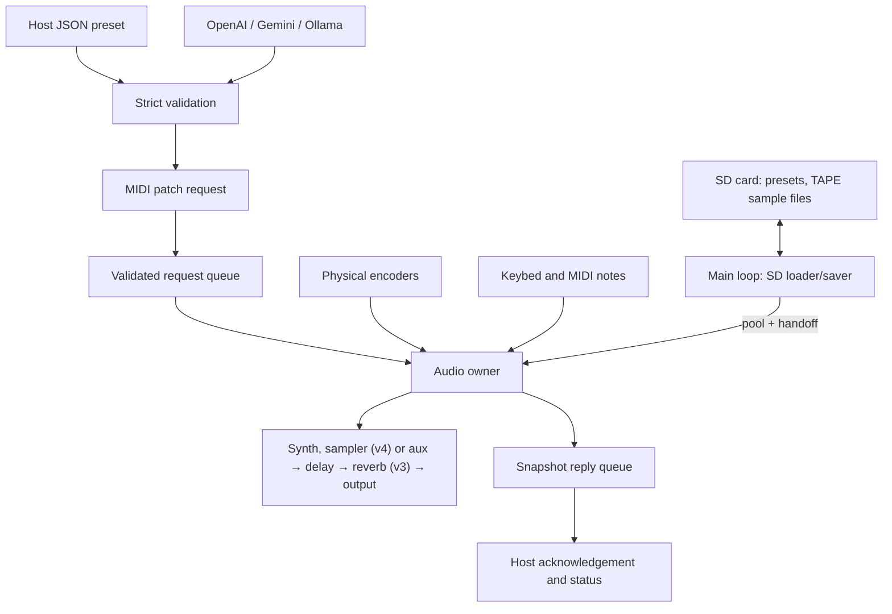

> Updated for candidate 0.5: audio originates from the synth (v3: two oscillators,
> noise, resonant filter, LFO), the sampler (v4) or aux, then delay and reverb.
> Read [PROTOCOL.md](PROTOCOL.md) for v1–v4 module DATA, [SAMPLING.md](SAMPLING.md)
> for the sampler design and [CONTINUE.md](CONTINUE.md)
> for the current implementation/verification checkpoint.

# Forge architecture

Applies to software candidate 0.5. Exact ranges and defaults live in the
[firmware guide](../../firmware/chompi-forge/README.md); byte layouts live in the
[protocol](PROTOCOL.md).

## Boundaries

The Daisy owns audio processing and active parameter state. The computer owns
human-readable patch files and optional AI authoring. MIDI carries validated
commands between them. A saved patch changes existing DSP parameters without
compilation; a new algorithm or routing graph still requires firmware work.

## Audio path

The reused hardware class configures 48 kHz audio in 24-frame blocks. The
callback selects auxiliary channels 2/3, the mono synth (up to four voices) or
the stereo sampler (up to seven voices),
processes the stereo delay and, for v3 patches, the reverb, and mirrors the
result to headphone channels 0/1 and main channels 2/3. Microphone channel 0
is used only as a recording source (monitored while recording).

Sampler (v4): each voice reads its slot from SDRAM (4-point Hermite when
pitched down, linear otherwise), handles loop crossfade/one-shot/reverse, then
runs the same amplitude and filter envelopes, a stereo pair of the v3 SVF, the
LFO and glide. Reads never pass a slot's published `loaded` count. The
recorder (audio owner) writes the chosen input or the output (resample) into
its own 16 MB SDRAM buffer with 5 ms edge fades and an incremental peak.

Synth paths: v1/v2 patches use the original voices summed into one shared
one-pole low-pass (kept bit-exact). v3 voices each run oscillator 1, an optional
oscillator 2 and noise, normalized, into their own topology-preserving
state-variable low-pass whose cutoff combines the smoothed base cutoff, the
voice's filter envelope and the shared LFO; coefficients refresh every 16
samples (one `tan` per voice). The reverb is a 4-line feedback delay network
(Hadamard mixing, per-line damping, gains from the requested decay time, so it
is stable for all settings) in 34 KB of DTCM, like the stock apps' reverbs
(its lines exceed the 16 KB data cache); it is skipped while its mix is
zero. CPU cost scales with the patch's voice count (1–4).

Each channel has its own delay buffer in SDRAM. Initialization clears both
buffers before audio starts. Reverb memory is not cleared (DTCM is not zeroed
at boot); its unread counter returns silence until every cell has been
rewritten, and a test feeds it NaN-filled memory to prove that. Parameter changes use one-pole smoothing; changing
delay time therefore glides in pitch. Wet bypass moves the wet mix toward zero
without clearing the delay or changing output level. Numeric input/output bounds
are hard clips, not a transparent limiter.

## Execution and ownership

| Context | Owns / does | Must not do |
| --- | --- | --- |
| UART receive callback | UART byte framer and UART frame-queue producer | Mutate DSP or perform disk/model work |
| USB receive callback | USB byte framer and USB frame-queue producer | Mutate DSP or perform disk/model work |
| Main loop | Decode frames, validate requests, enqueue controls, transmit replies, battery checks | Change live DSP state directly |
| Audio callback | Consume requests, apply whole patches, poll encoders, process samples, publish snapshots | Parse JSON, access storage/network, call AI, transmit MIDI, or allocate memory in the Forge core |
| Computer host | JSON validation/persistence, optional model requests, MIDI request/reply matching | Assume a timed-out send definitely failed |

`SpscQueue` requires one producer and one consumer per instance. UART and USB
therefore have separate ingress queues. Main merges them into the request queue;
audio publishes into the response queue. The outgoing queue is managed entirely
by main. Indices use lock-free atomics with acquire/release ordering.

Audio consumes at most 16 requests per block and stops if response capacity is
unavailable. Local encoders apply after queued requests in that block. Overload
can drop new control/reply items; it never waits for a queue inside the audio
callback. The protocol documents counter and timeout behavior.

Stuck-note recovery: main is the only writer of an atomic emergency count,
raised on a dropped note/ingress frame or CC120/123, and stamps every queued
`Request.epoch` with it (host-side only, not on the wire). Audio's
`RecoveryGate` panics once per newer count, drops performance events (notes,
pedal, bend, CC121) stamped older, and
executes everything else, so notes sent after an emergency are never lost
waiting for the queue to drain. Keybed notes and SW5 act directly in the
callback and bypass the gate.

## Samples (SD card) and the memory handoff

The main loop owns all sample file I/O (`SampleLoader`, `FatFsSampleFiles`):
it scans the root once per mount for TAPE names, loads the wanted chromatic
slot or kit bank into the 40 MB pool in 16 KB steps (one per loop pass), and
runs save/copy/erase jobs via a temp file. The audio callback publishes the
wanted selection (`PackSelection`) each block. Before rewriting slot memory
the loader asks `SampleHandoff` to detach: the audio owner then refuses new
file-slot notes, fades the sounding ones (2 ms) and acknowledges; only then
does the main loop rewrite the slot table, and it publishes when the headers
are in. Saving the recording locks it in the audio owner first (no new take
can start) and the main loop unlocks it after writing. Panel sample actions
(select, source) are applied in the audio callback; file jobs cross on
`sample_jobs` (audio → main).

## Device presets (SD card)

The audio callback runs the TAPE-style `PresetMenu` state machine (no I/O): it
reads the toggle and CHOMPI key, swallows key presses while the menu is open,
and queues actions with a parameter snapshot (`panel_actions`, audio → main).
The main loop owns the SD card (`FatFsStorage`, libDaisy FatFS) and
`PresetStore`. It writes, erases and copies, and turns recalls into ordinary
patch requests (silent for the panel and program change). Host store requests
go through the audio owner once for a snapshot (`ResponseKind::Snapshot`), then
the main loop writes and replies. Key LEDs are drawn by the main loop at
~30 Hz from the menu's packed state, the bank occupancy and the last recalled
slot. Card removal is polled once a second; reinsertion remounts and rescans.

## Patch lifecycle

1. A user edits JSON or an optional model returns it. The host strictly validates
   the complete object, engine, version, keys, types and ranges.
2. The host converts physical values to normalized 14-bit words, with bypass,
   route/waveform and v3 enum/integer bytes, then sends one checksummed SysEx
   message with a sequence number. Cutoff and LFO rate use logarithmic mappings.
   One ordered field table on each side (`V3_FIELDS` in forge_host.py,
   `V3Fields` in core/protocol.h) defines the v3 layout.
3. Firmware validates the entire payload before queueing it. The audio owner
   assigns the full parameter set between blocks; rejected patches leave the
   current state intact.
4. Audio publishes a snapshot. Main sends it back on the originating transport.
   The host verifies sequence, checksum and acknowledged parameter values.
5. Capture queries current targets and saves them on the computer. Names and
   JSON files remain on the host; the device retains one volatile patch only.

Acknowledgement means target values were accepted, not that the sound has been
auditioned or the smoothing has settled. Later controls may change those targets.
There is no automatic retry or sequence deduplication; after a timeout, query
status before deciding to resend.

## Transport details

Forge's small byte framer ignores real-time bytes inside notes/CC/SysEx, handles note/CC
running status, and discards oversized SysEx in full. It replaces dependence on
the upstream event parser without modifying the vendored source.

USB responses use a Forge packetizer that keeps F7 in the final USB-MIDI event
packet. The transmit buffer (132 bytes) remains allocated until completion and
is not rewritten while busy; the 98-byte v4 reply spans more than one 64-byte USB
packet. UART replies use a timeout computed from the reply length. These transmission paths execute in main; physical transport behavior
still needs the consolidated test.

## Source map

Paths below are relative to `firmware/chompi-forge/`.

| Path | Responsibility |
| --- | --- |
| `src/forge_main.cpp` | CHOMPI wiring, boot sequence, audio callback, transport adapters, replies and CPU meter |
| `core/engine.h` | Allocation-free source → delay → reverb → output path and whole-patch application |
| `core/reverb.h` | Stereo 4-line FDN reverb, caller-owned memory, O(1) clear |
| `core/parameters.h` | Normalized parameter state, validation and CC mapping |
| `core/runtime.h` | Channel-message translation (`TranslateChannel`), audio-owner request execution and epoch-based `RecoveryGate`, shared with offline tests |
| `core/command_queue.h` | Generic bounded single-producer/single-consumer queue |
| `core/midi_framer.h` | Byte framing, running status, overflow and resynchronization |
| `core/protocol.h` | Request validation, patch encoding fields, status/error replies |
| `core/usb_packets.h` | Complete-SysEx USB-MIDI packetization |
| `core/preset_store.h` | Storage interface, SD record format (CRC), PresetStore save/load/erase/copy/occupancy |
| `core/preset_menu.h` | TAPE-style panel preset menu state machine and its key-LED model |
| `src/fatfs_storage.h` | Storage and sample files on the SD card via FatFS (temp file + rename, root listing) |
| `core/wav.h` | WAV parsing/conversion (PCM 8/16/24, float, mono/stereo) and TAPE's 44-byte header |
| `core/sample_table.h` | Sample slots shared by audio and main (release/acquire `loaded` counts) |
| `core/recorder.h` | Recording into the RAM slot: sources, fades, normalising gain, save lock |
| `core/sample_loader.h` | TAPE names, `SampleFiles`, `SampleHandoff`, chunked loader and save/copy/erase jobs |
| `core/sampler_runtime.h` | Sampler request helpers shared by firmware and harness (select, lock-for-save, replies) |
| `core/synth.h` | Up to four voices (seven on v4): two band-limited oscillators, sample voices, noise, amp/filter envelopes, per-voice resonant SVF (v3) or shared one-pole (v1/v2), LFO, glide, pedal/bend/wheel, click-free voice reuse and ownership |
| `host/forge_host.py` | Python CLI, JSON schema, preset files, MIDI exchange, optional Ollama adapter |
| `host/forge_ai.py` | OpenAI/Gemini HTTPS adapters, structured output and independent validation |
| `host/forge_web.py` | Loopback server, session/origin checks, request bounds and serialized MIDI access |
| `host/web/` | Browser authoring, ephemeral key field, patch editor and explicit device actions |
| `host/forge_probe.cpp` | Offline request harness and synthetic audio rendering through the same DSP |
| `host/package_candidate.py` | Versioned test bundle, manifest and file hashes |
| `tests/` | DSP, queue, framing, protocol and host integration verification |

WAVE supplies `hardware.h`, `encoder.cpp`, the SRAM linker script and modified
libDaisy. Its library is rebuilt into Forge's ignored build directory. The
upstream firmware and bootloader sources remain separate.
