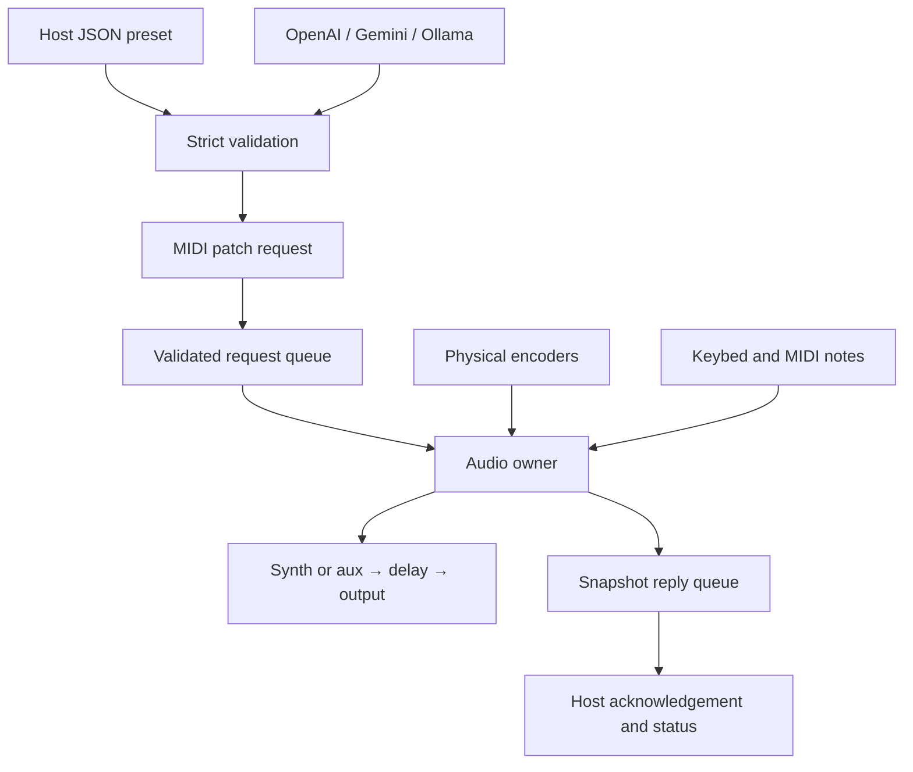

> Updated for candidate 0.3: audio can originate from the four-voice synth or aux.
> Read [PROTOCOL.md](PROTOCOL.md) for v2 module DATA and [CONTINUE.md](CONTINUE.md)
> for the current implementation/verification checkpoint.

# Forge architecture

Applies to software candidate 0.3. Exact ranges and defaults live in the
[firmware guide](../../firmware/chompi-forge/README.md); byte layouts live in the
[protocol](PROTOCOL.md).

## Boundaries

The Daisy owns audio processing and active parameter state. The computer owns
human-readable patch files and optional AI authoring. MIDI carries validated
commands between them. A saved patch changes existing DSP parameters without
compilation; a new algorithm or routing graph still requires firmware work.

## Audio path

The reused hardware class configures 48 kHz audio in 24-frame blocks. The
callback selects auxiliary channels 2/3 or the four-voice mono synth, processes
the stereo delay, and mirrors the result to headphone channels 0/1 and main channels 2/3. Microphone channel 0
is not mixed into the effect.

Each channel has its own delay buffer in SDRAM. Initialization clears both
buffers before audio starts. Parameter changes use one-pole smoothing; changing
delay time therefore glides in pitch. Wet bypass moves the wet mix toward zero
without clearing the delay or changing output level. Numeric input/output bounds
are hard clips, not a transparent limiter.

## Execution and ownership

| Context | Owns / does | Must not do |
| --- | --- | --- |
| UART receive callback | UART byte framer and UART frame-queue producer | Mutate DSP or perform disk/model work |
| USB receive callback | USB byte framer and USB frame-queue producer | Mutate DSP or perform disk/model work |
| Main loop | Decode frames, validate requests, enqueue controls, transmit replies, battery checks | Change live DSP state directly |
| Audio callback | Consume requests, apply whole patches, poll encoders, process samples, publish snapshots | Parse JSON, access storage/network, call AI, transmit MIDI, or allocate memory in the Forge core |
| Computer host | JSON validation/persistence, optional model requests, MIDI request/reply matching | Assume a timed-out send definitely failed |

`SpscQueue` requires one producer and one consumer per instance. UART and USB
therefore have separate ingress queues. Main merges them into the request queue;
audio publishes into the response queue. The outgoing queue is managed entirely
by main. Indices use lock-free atomics with acquire/release ordering.

Audio consumes at most 16 requests per block and stops if response capacity is
unavailable. Local encoders apply after queued requests in that block. Overload
can drop new control/reply items; it never waits for a queue inside the audio
callback. The protocol documents counter and timeout behavior.

## Patch lifecycle

1. A user edits JSON or an optional model returns it. The host strictly validates
   the complete object, engine, version, keys, types and ranges.
2. The host converts physical values to normalized 14-bit words, with bypass
   and v2 route/waveform bytes, then sends one checksummed SysEx message with
   a sequence number. Cutoff uses a logarithmic mapping.
3. Firmware validates the entire payload before queueing it. The audio owner
   assigns the full parameter set between blocks; rejected patches leave the
   current state intact.
4. Audio publishes a snapshot. Main sends it back on the originating transport.
   The host verifies sequence, checksum and acknowledged parameter values.
5. Capture queries current targets and saves them on the computer. Names and
   JSON files remain on the host; the device retains one volatile patch only.

Acknowledgement means target values were accepted, not that the sound has been
auditioned or the smoothing has settled. Later controls may change those targets.
There is no automatic retry or sequence deduplication; after a timeout, query
status before deciding to resend.

## Transport details

Forge's small byte framer ignores real-time bytes inside notes/CC/SysEx, handles note/CC
running status, and discards oversized SysEx in full. It replaces dependence on
the upstream event parser without modifying the vendored source.

USB responses use a Forge packetizer that keeps F7 in the final USB-MIDI event
packet. The transmit buffer remains allocated until completion and is not
rewritten while busy. UART replies use a timeout sufficient for the full status
message. These transmission paths execute in main; physical transport behavior
still needs the consolidated test.

## Source map

Paths below are relative to `firmware/chompi-forge/`.

| Path | Responsibility |
| --- | --- |
| `src/forge_main.cpp` | CHOMPI wiring, boot sequence, audio callback, transport adapters, replies and CPU meter |
| `core/engine.h` | Allocation-free stereo-delay DSP and whole-patch application |
| `core/parameters.h` | Normalized parameter state, validation and CC mapping |
| `core/runtime.h` | Audio-owner request execution shared with offline tests |
| `core/command_queue.h` | Generic bounded single-producer/single-consumer queue |
| `core/midi_framer.h` | Byte framing, running status, overflow and resynchronization |
| `core/protocol.h` | Request validation, patch encoding fields, status/error replies |
| `core/usb_packets.h` | Complete-SysEx USB-MIDI packetization |
| `core/synth.h` | Fixed four-voice oscillators, ADSR, velocity, voice ownership and low-pass tone |
| `host/forge_host.py` | Python CLI, JSON schema, preset files, MIDI exchange, optional Ollama adapter |
| `host/forge_ai.py` | OpenAI/Gemini HTTPS adapters, structured output and independent validation |
| `host/forge_web.py` | Loopback server, session/origin checks, request bounds and serialized MIDI access |
| `host/web/` | Browser authoring, ephemeral key field, patch editor and explicit device actions |
| `host/forge_probe.cpp` | Offline request harness and synthetic audio rendering through the same DSP |
| `host/package_candidate.py` | Versioned test bundle, manifest and file hashes |
| `tests/` | DSP, queue, framing, protocol and host integration verification |

WAVE supplies `hardware.h`, `encoder.cpp`, the SRAM linker script and modified
libDaisy. Its library is rebuilt into Forge's ignored build directory. The
upstream firmware and bootloader sources remain separate.
